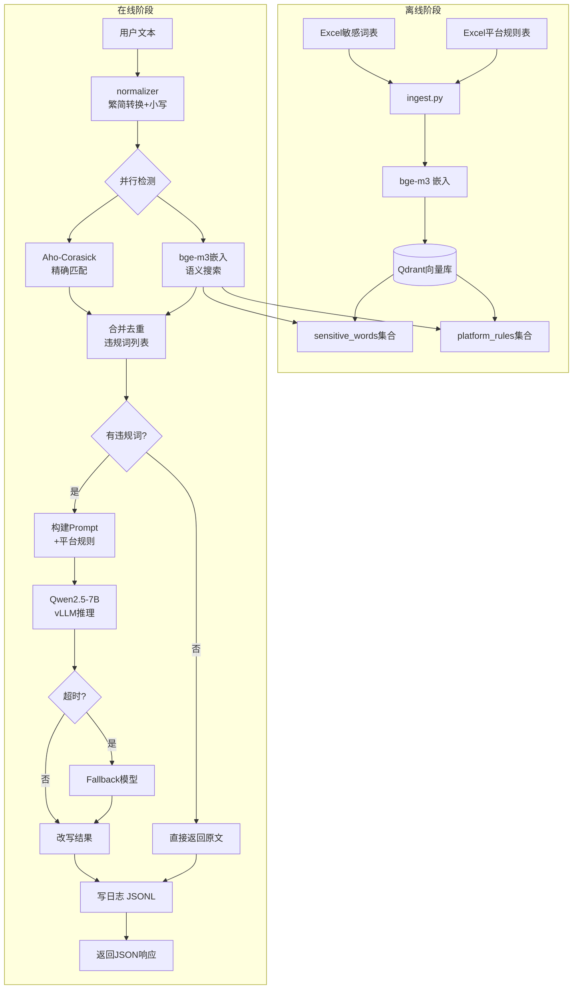

# 内容合规检测系统

基于本地大语言模型的 MLOps 内容合规服务，支持敏感词精确匹配 + 语义检索 + LLM 智能改写的完整流水线。

---

## 项目简介

本项目为电商/社交/直播等场景提供实时内容合规检测与自动改写能力：

- **双重检测**：Aho-Corasick 精确匹配 + bge-m3 语义向量相似度检索
- **智能改写**：基于 Qwen2.5-7B-Instruct（GPTQ 量化）通过 vLLM 推理，主模型超时自动切换备用模型
- **低延迟设计**：无违规词时跳过 LLM，无命中 P50 < 200ms，有命中 P50 < 800ms
- **完整 MLOps**：FastAPI 后端 + systemd 进程守护 + crontab 健康监控 + JSONL 请求日志

---

## 架构图



---

## 技术栈

| 组件 | 技术 | 说明 |
|------|------|------|
| 嵌入模型 | bge-m3 (1024维) | SentenceTransformers 本地推理 |
| 生成模型 | Qwen2.5-7B-Instruct-GPTQ-Int4 | vLLM 服务，OpenAI 兼容接口 |
| 向量数据库 | Qdrant | Docker 部署，异步客户端 |
| 精确匹配 | pyahocorasick | 多模式字符串匹配 |
| 文本规范化 | opencc-python-reimplemented | 繁简体转换 |
| Web 框架 | FastAPI + uvicorn | lifespan 模式，异步全链路 |
| 进程管理 | systemd / screen | 生产/开发环境分别使用 |
| 监控 | monitor.sh + crontab | 每分钟健康检查，自动重启 |

---

## 目录结构

```
compliance_project/
├── autodl_setup.sh           # AutoDL 一键部署脚本（screen 模式）
├── production_setup.sh       # 生产环境部署脚本（systemd 模式）
├── monitor.sh                # 健康监控脚本
├── benchmark.py              # 性能基准测试
├── embed_server.py           # bge-m3 嵌入服务（端口 8001）
├── model_download.py         # 模型下载（ModelScope/HuggingFace 双源）
├── models/                   # 模型文件目录
├── logs/                     # 日志目录
│   ├── requests.jsonl        # 请求详情日志
│   └── benchmark_report.txt  # 性能报告
└── compliance_service/
    ├── .env                  # 环境变量配置
    ├── requirements.txt      # Python 依赖
    ├── cli.py                # 命令行工具
    ├── frontend/
    │   └── index.html        # 单文件前端
    └── backend/
        ├── main.py           # FastAPI 入口（lifespan 模式）
        ├── config.py         # 配置加载
        ├── pipeline.py       # 主流程编排
        ├── detector.py       # 检测逻辑（精确+语义）
        ├── rewriter.py       # LLM 改写（主+备用）
        ├── normalizer.py     # 文本规范化
        ├── prompt.py         # Prompt 模板
        ├── vector_store.py   # Qdrant 异步客户端
        └── scripts/
            └── ingest.py     # 数据导入脚本
```

---

## AutoDL 快速部署

### 前置准备

1. 上传项目到服务器：
```bash
scp -r compliance_project/ root@<autodl-ip>:/root/
```

2. 上传 Excel 数据文件：
```bash
scp 敏感词表.xlsx root@<autodl-ip>:/root/compliance_project/data/
scp 平台规则表.xlsx root@<autodl-ip>:/root/compliance_project/data/
```

3. 给脚本添加执行权限并运行：
```bash
ssh root@<autodl-ip>
chmod +x /root/compliance_project/autodl_setup.sh
cd /root/compliance_project
./autodl_setup.sh
```

脚本将自动完成 11 个步骤：环境检查 → 创建 venv → 安装依赖 → 下载模型 → 启动 Qdrant → 启动嵌入服务 → 启动 vLLM → 导入数据 → 启动后端 → 运行 benchmark → 汇总。

---

## 生产环境部署

生产环境使用 systemd 管理服务，支持开机自启和自动重启：

```bash
# 同步模型（如已在其他服务器下载）
rsync -avz --progress models/ root@<prod-ip>:/root/compliance_project/models/

# 运行生产部署脚本
chmod +x /root/compliance_project/production_setup.sh
./production_setup.sh
```

生产模式额外功能：
- 启动前检查 GPU 可用显存
- 检查端口冲突
- systemd 管理三个服务（embed_server / vllm_server / compliance_backend）
- crontab 每分钟执行 monitor.sh 健康检查

---

## 日常运维命令

### 查看服务状态
```bash
# systemd 模式（生产）
systemctl status embed_server vllm_server compliance_backend

# screen 模式（AutoDL）
screen -ls
screen -r embed    # 查看嵌入服务日志
screen -r vllm     # 查看 vLLM 日志
screen -r backend  # 查看后端日志
```

### 查看日志
```bash
tail -f /root/compliance_project/logs/requests.jsonl
tail -f /var/log/compliance_alert.log
```

### 重启服务
```bash
systemctl restart compliance_backend
systemctl restart embed_server
systemctl restart vllm_server
```

### 手动触发性能测试
```bash
cd /root/compliance_project
source venv/bin/activate
python benchmark.py
cat logs/benchmark_report.txt
```

### 查看统计 API
```bash
curl http://localhost:8000/stats | python3 -m json.tool
curl http://localhost:8000/health
```

---

## 更新敏感词流程

1. 替换/更新 Excel 文件：
```bash
scp 敏感词表_新版.xlsx root@<server>:/root/compliance_project/data/敏感词表.xlsx
```

2. 清空旧数据（可选）：
```bash
curl -X DELETE http://localhost:6333/collections/sensitive_words
```

3. 重新导入：
```bash
cd /root/compliance_project/compliance_service/backend
source ../../venv/bin/activate
python scripts/ingest.py
```

4. 重启后端以重新加载 Aho-Corasick 自动机：
```bash
systemctl restart compliance_backend
```

---

## 性能指标（RTX 3090 24GB 参考）

| 指标 | 目标值 | 说明 |
|------|--------|------|
| 无命中 P50 总延迟 | < 200ms | 跳过 LLM，仅嵌入+检索 |
| 有命中 P50 总延迟 | < 800ms | 含 LLM 改写 |
| 并发 10 P99 | < 1000ms | vLLM 批处理加速 |
| 并发 50 P99 | < 1500ms | 受 GPU 显存限制 |
| GPU 显存占用 | ~18GB | bge-m3(2GB) + Qwen2.5-7B-Int4(~14GB) |
| LLM 超时配置 | 800ms | 超时自动切换备用模型 |

---

## 故障排查

### 嵌入服务无响应
```bash
# 检查日志
cat /root/compliance_project/logs/embed_server.log

# 常见原因：CUDA OOM
nvidia-smi  # 检查显存
```

### vLLM 启动失败
```bash
cat /root/compliance_project/logs/vllm_server.log
# GPU显存不足 → 降低 GPU_MEMORY_UTILIZATION=0.7
# CUDA不兼容 → 检查 torch 版本与 CUDA 版本匹配
```

### Qdrant 连接失败
```bash
docker ps | grep qdrant
docker logs qdrant_compliance
curl http://localhost:6333/healthz
```

### 后端启动后 automaton_words=0
```bash
# 数据未导入，执行：
cd /root/compliance_project/compliance_service/backend
python scripts/ingest.py
systemctl restart compliance_backend
```

---

## Redis 缓存扩展

当前改写策略缓存预留接口位于 `pipeline.py` 的 `get_cached_strategy` 和 `set_cached_strategy` 函数。

启用步骤：
1. 安装 Redis：`apt install redis-server`
2. 安装客户端：`pip install redis`
3. 修改 `.env`：`REDIS_ENABLED=true`，`REDIS_HOST=localhost`
4. 实现 `pipeline.py` 中的两个缓存函数（以违规词列表 hash 为 key，TTL 7天）

---

## 优化路线

- [ ] **Redis 改写缓存**：相同违规词组合复用历史改写结果，减少 LLM 调用
- [ ] **批量处理接口**：`/process_batch` 支持一次请求处理多条文本
- [ ] **向量量化**：对 Qdrant 集合启用 scalar quantization，降低内存占用 75%
- [ ] **流式输出**：`/process/stream` 使用 SSE 流式返回改写进度
- [ ] **规则热更新**：无需重启即可更新敏感词表（通过 `/admin/reload` 接口）
- [ ] **多 GPU 支持**：bge-m3 与 Qwen2.5 分布在不同 GPU，消除显存竞争
